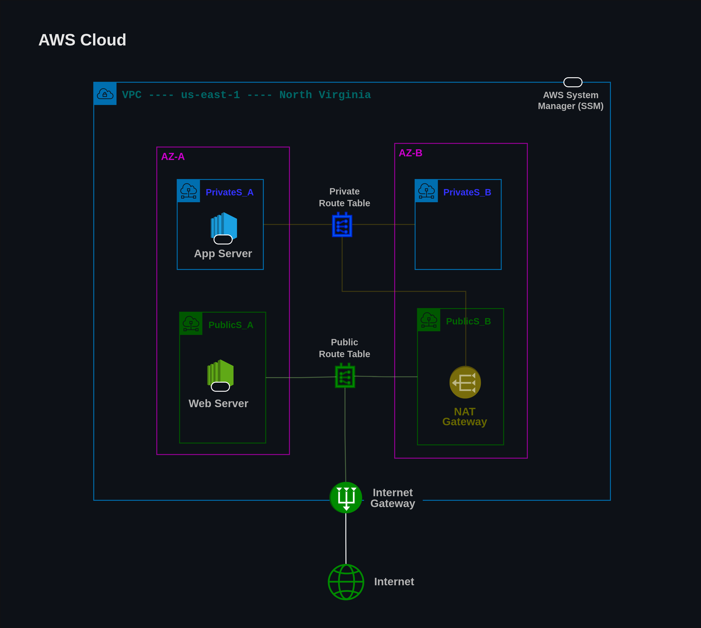
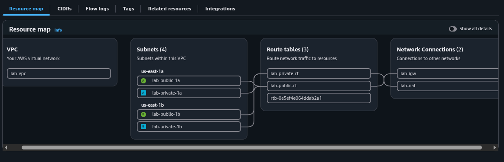
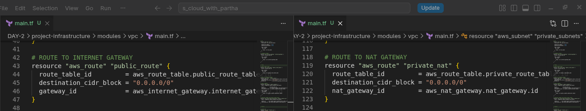
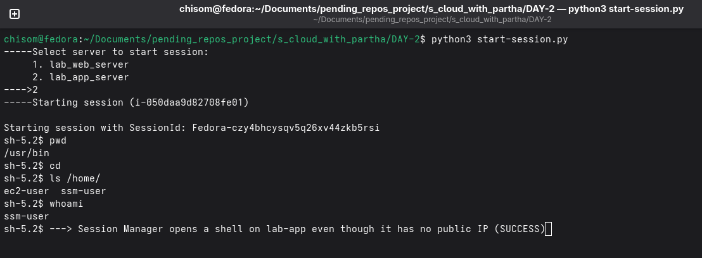
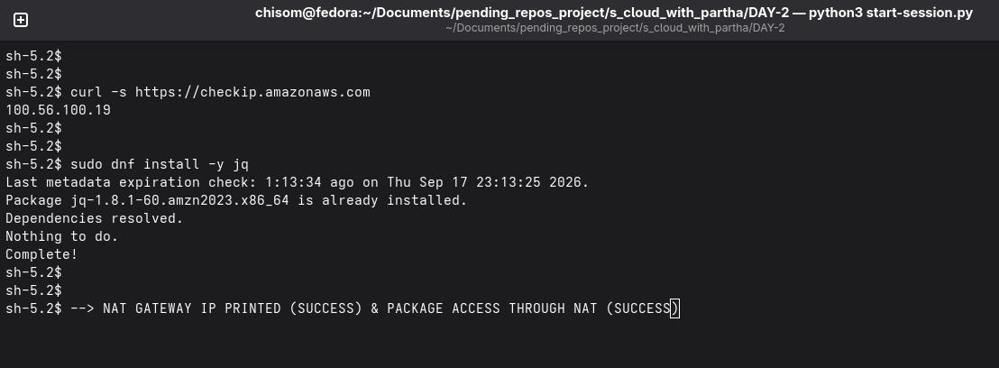

# DAY 2 - EC2 & VPC DEEP DIVE  

## NAVIGATION 
**[DAY 1](../DAY-1/aws_cloud_fundamentals.md)**   
**[HOME](../README.md)**   

## WHAT DOES A VIRTUAL MACHINE NEED?
### CPU
**A Central Processing Unit (CPU)** is the primary computer chip that acts as the **brain** of a digital system by executing program instructions, running operating systems and managing calculations.  
  
**Main Components of a CPU**
- **Control Unit (CU):** Directs the flow of data and tells the computer's memory, logic, and output devices how to respond to instructions.
- **Arithmetic Logic Unit (ALU):** Performs basic math calculations (addition, subtraction) and logical comparisons (true/false, yes/no).
- **Cache & Registers:** Ultra-fast, internal memory spaces that temporarily store active data and upcoming instructions for immediate access.
- **Internal Clock:** Generates electrical pulses to synchronize the chip's internal operations, measured in Hertz (Hz) to define speed.  
   
**How a CPU Works**
- **Fetch:** The processor retrieves an instruction from the computer's Random Access Memory (RAM).
- **Decode:** The control unit translates the binary instruction code into actionable signals.
- **Execute:** The arithmetic logic or other components carry out the specific task, storing or outputting the resulting data.  
    
**Common Uses and Applications**
- Running operating systems like Linux, Windows or MacOS.
- Opening, loading and executing software applications and web browsers.
- Managing multitasking across multiple processing cores on devices ranging from smartphones to massive enterprise servers.

---

### RAM (RANDOM ACCESS MEMORY)
**Random Access Memory (RAM)** is a computer's short-term memory that temporarily stores active data and programs for quick access by the processor.

**How RAM Works**
- Acts as a digital workbench for your device, holding files and apps currently in use.
- Allows the Central Processing Unit (CPU) to retrieve data much faster than reading from a hard drive or solid-state drive (SSD).
- Clears all stored data immediately when the devices loses power, making it volatile memory.

---

### Storage
**Storage** in a virtual machine (VM) uses a software-based file called a virtual disk that acts like a real physical hard drive.  
   
**How Virtual Machine Storage Works**
- **Virtual Disks:** VMs save their operating system, files, and programs inside a single container file storage on the host computer or a network server.
- **Common Formats:** Different programs use different files type, such as `.vdi` for Oracle Virtual Box, `.vmdk` for VMware and `.vhdx` for Microsoft Hyper-V.
- **Allocation Types:**
  - Dynamic (Thin Provisioning): The virtual disk starts small and grows larger as you add more files.
  - Fixed: The storage is set to a single large limit immediately.  
   
**Where Storage is Located**
- **Local Storage:** The virtual disk file lives directly on the physical hard drive of the computer running the VM.
- **Remote Storage:** The file sits on an external network, a NAS (Network Attached Storage), or a cloud server accessed through the internet.  
   
---

### NETWORK/IP
An **IP Address (Internet Protocol Address)** is a unique numerical label assigned to every device connected to a computer network.  
  
**Type of IP Addresses**
- **Public IP:** The main address assigned by your Internet Service Provider (ISP) that identifies your network or router to the outside internet.
- **Private IP:** A local address assigned by your router to identify individual devices (like phones, laptops, or Smart TVs) inside your home or office network.
- **Static & Dynamic IP:** ***Static*** are manually set and never change, while ***dynamic*** addresses are automatically assigned by your router and can change over time.  
  
**IP Address Versions**
- **IPv4:** The older, most common format made of four numbers separated by periods (e.g., 192.168.2.1).
- **IPv6:** The newer format using alphanumeric characters separated by colons (e.g., 2001:db8::ff00:42:8329) to handle the massive growth of connected devices.  
   
*Without an IP Address EC2 instances cannot send or receive requests or communicate with another servers/services.

---

## **VPC:** Why It Is Critical For **EC2**
**VPC** is critical for an EC2 instance because it provides the foundational network layer and security boundaries that control how the virtual server communicates with the internet and other resources.  

---

### Core Reasons VPC is critical
- **Network Isolation:** A VPC creates a private, fenced-off section of the cloud for EC2 instances, keeping your data separate from other AWS accounts and the public internet.
- **Traffic Control through Subnets:** It allows you to divide your network into ***public subnets*** (for resources needing internet access, like load balancers) and ***private subnets*** (for sensitive EC2 servers and databases that should remain hidden).
- **Built-in Firewalls:** Through ***Security Groups*** and ***Network ACLs***, a ***VPC*** acts as a virtual security guard, letting you dictate exact rules for inbound and outbound traffic at both the instance and subnet level.
- **Scalability and Customization:** It gives total control over IP address ranges and routing tables, allowing network to scale smoothly from a single test server to thousands of enterprise instances.
- **Routing and Gateways:** Components like ***Internet Gateways*** and ***NAT Gateways*** manage how your EC2 instances connect to the outside world or pull software updates safely without exposing internal components.

---

**A virtual Private Cloud (VPC)** is an isolated private network inside a public cloud where you can launch and run your cloud resources safely.

---

### Core VPC Components
- **VPC (Virtual Private Cloud):** The main private network container defined by a range of IP addresses (CIDR Block).
- **Subnet:** A smaller segment of the VPC's IP address range that splits resources across Availability Zones (AZs). They are split into:
  - **Public Subnet:** Connected to the internet. Used for web servers or load balancers.
    Features:
    - Exists only in one Availability Zone (AZ)
    - Internet access through Internet Gateway
    - Auto assign public IP or Elastic IP
    - Use case: Internet facing resouces e.g. Web servers, Application Load Balancers (ALB), Bastion Server etc.
  - **Private Subnet:** Hidden from the internet. Used for secure databases and backend apps.
    Features:
    - Exists only in one Availability Zone (AZ)
    - Only outbound traffics to internet through Nat Gatway.
    - Auto assigned private IP only. 
    - Use case: Servers with sensitive data needed to be hidden. e.g Databases, Backends, Caches, APIs etc
- **Route Table:** A set of matching rules (routes) that determines where network traffic is directed from your subnets.
- **Internet Gatway:** A component that lets two-way communication happen between resources in your public subnets and the public internet.
- **NAT Gateway (Network Address Translation):** A managed service that allows resources in a private subnet to initial outbound internet traffic (such as software updates) while blocking inbound traffic from the outside.
- **Security Groups:** Virtual firewalls that operate at the instance level to control inbound and outbound traffic for specific resources.
- **Network Access Control Lists (NACLs):** Optional, subnet-level firewalls that provide an extra layer of security usibf priorities for inbound and outbound traffic.
- **VPC Endpoints:** Private connections that links VPC directly to supported external cloud services without requiring traversal across the public internet.

---

### How Traffics Flows

---

## WHY DO WE NEED PUBLIC AND PRIVATE SUBNETS?
We need public and private subnets in AWS to separate resources that face the public internet from sensitive backend components that require strict security and isolation.

---

## VPC MUST-KNOW ASPECTS
### 5 Reserved IPs in Every subnets
| Address | Reserved For | Example |
| ------- | ------------ | ------- |
| .0 | Network address | 10.0.1.0 |
| .1 | VPC Router (Default Gateway) | 10.0.1.1 |
| .2 | DNS Server (Amazon Provided) | 10.0.1.2 |
| .3 | Reserved for future AWS use | 10.0.1.3 |
| .255 | Broadcast (not supported in VPC) | 10.0.1.255 |

---

### VPC default Quotas (Limits)
Most can be increase through AWS Support.
| Name | Default | Adjustable? |
| ---- | ------- | ----------- |
| VPCs Per Region | 5 | Yes |
| Subnets Per VPC | 200 | Yes |
| Route Tables per VPC | 200 | Yes |
| Security Groups per VPC | 500 | Yes |
| Rules per Security Group | 60 in / 60 out | Yes |
| Elastic IPs per Region | 5 | Yes |
| Internet Gateways per Region | 5 | Yes |
| Nat Gateways per AZ | 5 | Yes |
  
[More about VPC Quotas in AWS Documentation](https://docs.aws.amazon.com/vpc/latest/userguide/amazon-vpc-limits.html)

---

### VPC Cost Breakdown
| Name | Cost |
| ---- | ---- |
| VPC | Free |
| Subnets | Free |
| Route Tables | Free |
| Security Groups | Free |
| Internet Gateway | Free |
| Nat Gateway | $0.045/hr + $0.045/GB |
| Elastic IP (when attached to running instance) | Free |
| Idle Elastic IP | 0.005/hr |
  
[More information on AWS Documentation](https://aws.amazon.com/vpc/pricing/)

---

### VPC Architecture Best Practices
See AWS Docs [Reference](https://docs.aws.amazon.com/vpc/latest/userguide/vpc-security-best-practices.html)

---

# HANDS ON LAB (VPC & EC2)
This hands-on lab is automated using Terraform and Python.

## AWS Infrastructure Plan

## Prerequisites
Ensure the following tools are installed on your local machine:
* Terraform
* AWS CLI (installed and configured)
* Session Manager (SSM) Plugin / SSM Agent
* Python 3+

---

## Automation Scripts
* `create_infra.py` Creates the infrastructure.
* `start_session.py` Starts an SSM session (works only if `create_infra.py` has successfully created the infrastructure).
* `destroy_infra.py` Destroys the infrastructure and deletes all generated files.

---

## VALIDATE END-TO-END
# The VPC has four subnets spread over us-east-1a and us-east-1b.
  
   
# lab-public-rt has 0.0.0.0/0 -> IGW; lab-private-rt has 0.0.0.0/0 -> NAT.
  
   
# http:// serves the public tier page.
  
  
# Session Manager opens a shell on lab-app even though it has no public IP.
  
   
# checkip.amazonaws.com inside lab-app returns the NAT Gateway Elastic IP.

   
   
## NAVIGATION 
**[DAY 1](../DAY-1/aws_cloud_fundamentals.md)**   
**[HOME](../README.md)** 
