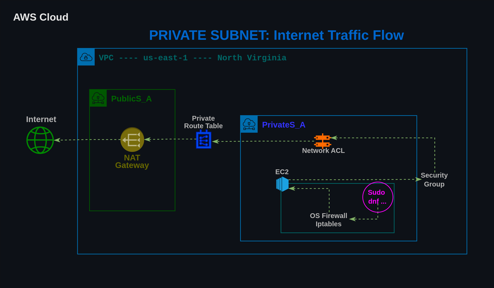
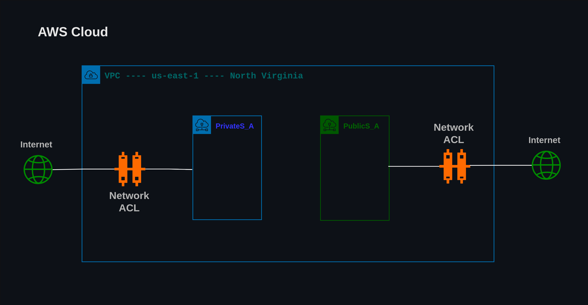
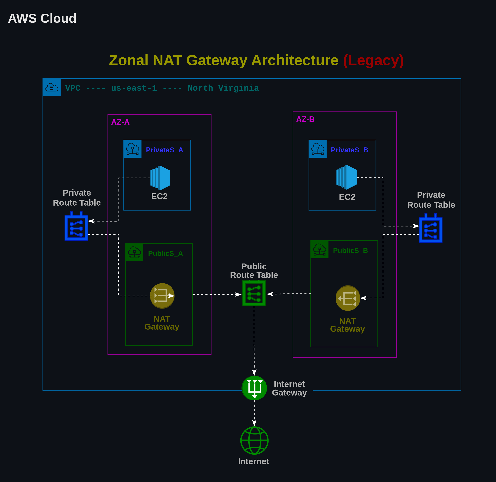
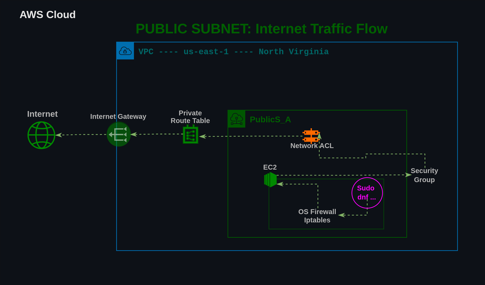

# NAVIGATION 
**[DAY 2](../DAY-2/ec2_and_vpc_deep_dive.md)**   
**[HOME](../README.md)** 

# AWS TRAFFIC FLOW VISUALIZATION

## Private Subnet Traffic Flow

### AOC: Subnet Network Access Control List (NACL)

A subnet NACL (Network Access Control List) is a virtual firewall that controls inbound and outgoing traffic at the individual subnet level inside a cloud network or Virtual Private Cloud (VPC).   
   
**Key Characteristics**   
- Each subnet in VPC must be associated with a network ACL. If don't explicitly associate a subnet with a network ACL, the subnet is automatically associated with the default network ACL.
- Network ACL can be associated with multiple subnets. However, a subnet can be associated with only one network ACL at a time. When you associate a network ACL with a subnet, the previous association is removed.
- It protects every single resource or server instance located inside that specific subnet.
- It does not remember previous connection requests. If you allow incoming traffic, you must explicitly write a separate rule to allow the return outgoing traffic back out.
- Rules are evaluated in order from the lowest number to the highest number (for example, rule 100 runs before rule 200).
- Unlike basic instance firewalls, NACLs let you explicitly block (deny) specific IP addresses or malicious ranges.  
- ***There is no additional charge for using network ACLs.*** 
   
**Network ACL Quota**   
| Name | Default | Adjustable | 
| ---- | ------- | ---------- |
| Network ACLs per VPC | 200 | Yes |
| Rules per network ACL | 20 | Yes |
    
**How It Works With Security Groups**    
- NACLs act as the first outer checkpoint guarding the entire subnet border.
- Security Groups act as the inner shield attached directly to individual server instances.
    
## NAT Gateway Architecture Evolution

### 
| Traditional NAT | Regional NAT |
| --------------- | ------------ |
| NAT is zonal | NAT is regional |
| Usually one NAT per AZ for HA | One Regional NAT |
| NAT lives in a public subnet | No public subnet required for the NAT |
| Separate routes per AZ | Can use the same NAT Gateway ID |
| Mannual expansion to new AZs | AWS automatically expands |
| More NAT Gateways/EIPs | Auto-scales bandwith |

## Public Subnet Traffic Flow

## Accessing Private Subnet EC2 (Bastion Host)
[Bastion Host](./images/cwp_day3_bastion_host.png)

## Source
- [DAY 3](https://learn.cloudwithpartha.com/day-3)
- [AWS Documentation: Network ACL](https://docs.aws.amazon.com/vpc/latest/userguide/vpc-network-acls.html)
- [Google]()
- [Gemini/ChatGPT]()